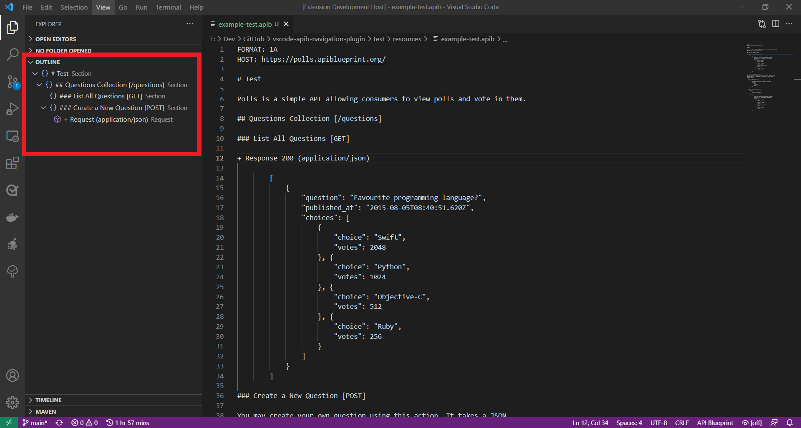

# vscode-apib-navigation-plugin README

VS Code extension for API Blueprint files.

It helps you to navigate in large API doc files easier using the VS Code Outline view. This extension adds the sections of the API doc to the Outline view in a hierarchical tree structure. On clicking an item in the tree will quickly jump the cursor to the line in the active editor tab where editing the `.apib` file.

## Features

Add hierarchical document tree in the VS Code Outline view:

## Requirements

No requirements or dependencies to use this extension.

## Extension Settings

This extension contributes the following settings:

* `myExtension.enable`: enable/disable this extension

## Known Issues

There are no known issues, yet.

## Release Notes

Users appreciate release notes, so here is some:

### 0.0.1

Initial release of this extension, coming soon...
